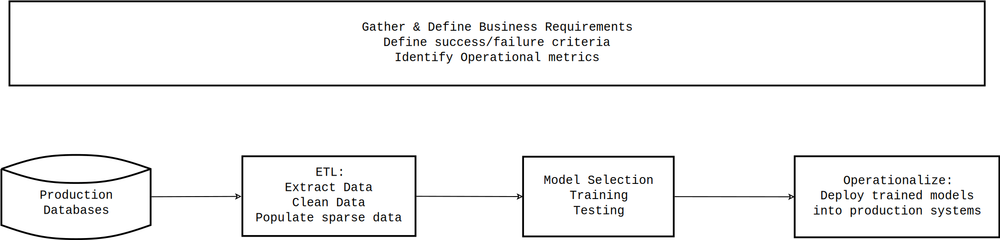

# ML_at_Scale

A quick description of the roles found in organizations that use ML at Scale

## Overview

ML is all well and good, but in a business context it must be able to deliver
value to the business. For that reason, it makes sense to create specialist
roles within a business ML department.

## Roles

As shown above, there are four roles in Production ML departments:

1. [Business Analyst](#business-analyst)
2. [Data Engineer](#data-engineer)
3. [Data Scientist](#data-scientist)
4. [Production Engineer](#production-engineer)

All of the above roles need some understanding and experience of ML practices.

#### Business Analyst

This role is more of an outward-facing role. It is over-arching and is
about re-framing ML practices into a business framework in terms of business
value (as defined by deliverables).

It is probably the least technical role, although technology and ML
expertise still plays a large factor in how valuable this person may be.

#### Data Engineer

This role is largely technical and mainly involves ETL; however, data
cleaning and transformation plays a large part. Populating sparse data
may also be a requirement. Database knowledge (both of traditional
relational databases [SQL] as well as NoSQL [CQL, GraphQL] databases)
and expertise is critical for this role.

#### Data Scientist

This is the most purely technical role. Experienced data scientists
are very hard to find and generally have very specific (and deep)
expertise and training. For this reason, it is best that they are
provided with clean data so that they can focus their energies on
tasks that they have been trained to do.

Mathematics, statistics and generally either R or Python expertise
seem to the main requirements for this role.

#### Production Engineer

This role calls for a generalist. Once a ML model is trained, it must
then be deployed in order to become operational and deliver business
benefit.

The how and why of this process can be very technical, but generally
will involve a number of separate disciplines - mostly involving more
traditional IT practices.

Generally, this is the role that a traditional data scientist is
__least__ qualified to perform. For this reason, it is a good idea
to source a candidate with a much broader skill-set. What these
skills will need to be largely depends upon the pre-existing
production systems.

## References

ETL

    http://en.wikipedia.org/wiki/Extract%2C_transform%2C_load

[Well worth reading for some historical insight into this process.]

## Credits

Inspired by this podcast on Behavioral economics and AI-driven decision making:

    http://changelog.com/practicalai/9

[This is an excellent podcast, some great stuff and worth following.]
